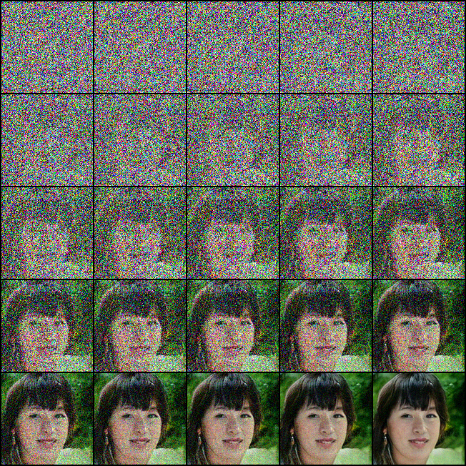
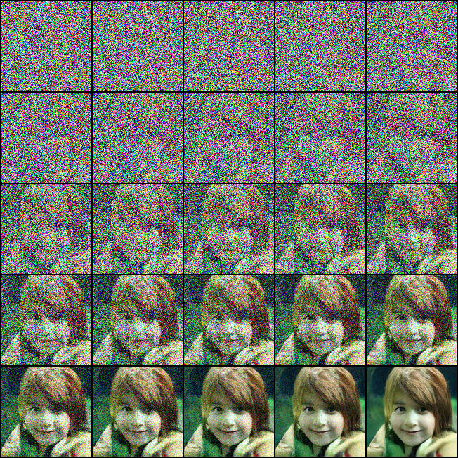

# denoising-diffusion-pytorch
Implementation of Denoising Diffusion Probabilistic Models in PyTorch

## Installation

First please install `tensorfn`

```bash
pip install tensorfn
```

It is simple convenience library for machine learning experiments. Sorry for the inconvenience.

## Training

First prepare lmdb dataset:

```bash
python prepare_data.py --size [SIZES, e.g. 128,256] --out [LMDB NAME] [DATASET PATH]
```

Then run training looop!


```bash
python train.py --n_gpu [NUMBER OF GPUS FOR TRAINING] --conf config/diffusion.conf 
```

Also, you can tried to use improved configurations from https://openreview.net/forum?id=-NEXDKk8gZ (Cosine beta schedule, more multi-headed self attention, affine modulation for time conditions, new training hyperparameters.)

```bash
python train.py --n_gpu [NUMBER OF GPUS FOR TRAINING] --conf config/improved.conf 
```

## Samples

Samples from FFHQ


